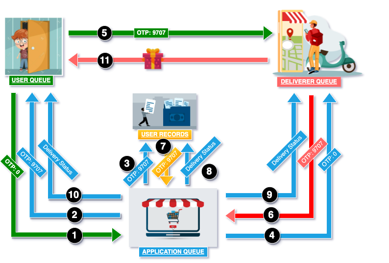
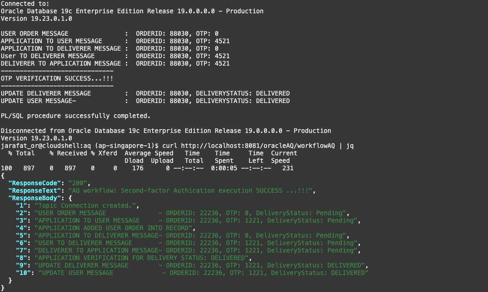

# 2FA_eCommeceApp_with_Oracle_AQ
Creating a 2FA eCommerce Application using Oracle Advanced Queuing 

```shell
# 1 . Start the setup
source setup.sh

# 2. Enter the password to be used for database connection and wait for the ATP provisioning when you will see the message: 
# "Action completed. Waiting until the resource has entered state: ('AVAILABLE',)".
Password=Comp1exPa$$word

# 3. The setup process will typically take around 5 minutes to complete.
ps -ef | grep "$ORACLEAQ_HOME" | grep -v grep

# Note: Cloud shell may disconnect after a period of inactivity. If that happens, you can reconnect and then re-run the above command to resume the setup.

# 4. Create Oracle AQ
cd $ORACLEAQ_PLSQL_AQ; source createAQ.sh;

# 5. AQ Enqueue
cd $ORACLEAQ_PLSQL_AQ; source enqueueAQ.sh;

# 6. AQ Dequeue
cd $ORACLEAQ_PLSQL_AQ; source dequeueAQ.sh;

# 7. Drop Queue- Cleanup
cd $ORACLEAQ_PLSQL_AQ; source cleanupAQ.sh;
```

## Use workflow with Oracle AQ (Second-factor Authentication)

```shell
# 1. Create Workflow queue
cd $ORACLEAQ_PLSQL_AQ; source workflowCreateAQ.sh;

### Step 2: Developing the Order Delivery Application

#### Algorithm 1: Queue Creation and Message Handling

INPUT: Order details, OTP  
OUTPUT: Updated delivery status

1. Create Queues
    - Define queue tables for user, application, and deliverer.
    - Initialize queues for user, application, and deliverer.

2. Enqueue Message
    - Define message content (order details).
    - Enqueue message into the user queue with status "PENDING".

3. Generate OTP
    - Generate a unique four-digit OTP.
    - Update order status to "PENDING" with OTP.
    - Record order details and OTP in the User Records table.
    - Share delivery details with Deliverer (OTP initially set to 0).

4. User Shares OTP with Deliverer
    - User provides the OTP to Deliverer.

5. Deliverer Validates OTP
    - Deliverer requests Application to validate the provided OTP.
    - Application checks the OTP against the User Records table.

6. OTP Verification
    - Successful OTP verification:
        - Update delivery status to "DELIVERED" in the User Records table.
        - Notify Deliverer and User of the updated status.
        - Deliverer hands over the order to User.
    - Failed OTP verification:
        - Update delivery status to "FAILED" in the User Records table.
        - Notify Deliverer and User of the failed status.
        - Deliverer declines the delivery to User.

RETURN: Updated delivery status ("DELIVERED" or "FAILED")

This algorithm ensures a secure and efficient delivery process using Oracle AQ, with each step reliably managed and recorded within the system.

cd $ORACLEAQ_PLSQL_AQ; source workflowEnqueueDequeueAQ.sh;

# 5. Cleanup - Drop the queues
cd $ORACLEAQ_PLSQL_AQ; source workflowCleanupAQ.sh;

```


# Setup up using Traditional Framework
```shell
### Algorithm 2: Queue Management Using Redis and REST API Development

INPUT: Order details, OTP  
OUTPUT: Updated delivery status

1. Initialize Redis Connection
    - Connect to Redis server at localhost on port 6379.

2. Enqueue Message
    - Push order details to the `user_queue`.

3. Order Placement API (Node.js)
    - Setup Express server.
    - Define endpoint `/placeOrder` to receive order details.
    - Enqueue received order details to `user_queue`.

4. Generate OTP
    - Define endpoint `/generateOtp` in Flask.
    - Generate a four-digit OTP.
    - Store OTP in Redis with the order ID as the key.
    - Return generated OTP.

5. User Shares OTP with Deliverer
    - User provides the OTP to Deliverer.

6. Deliverer Validates OTP
    - Define endpoint `/validateOtp` in Flask.
    - Retrieve OTP from Redis using order ID.
    - Compare provided OTP with stored OTP.

7. OTP Verification
    - Successful OTP verification:
        - Update delivery status to "DELIVERED" in Redis.
        - Notify Deliverer and User of the updated status.
    - Failed OTP verification:
        - Update delivery status to "FAILED" in Redis.
        - Notify Deliverer and User of the failed status.

8. Delivery Status Update (Java)
    - Define endpoint `/updateStatus` in Spring Boot.
    - Update delivery status in Redis with the order ID as the key.
    - Define endpoint `/getStatus/{orderId}` to retrieve the status of an order.

RETURN: Updated delivery status ("DELIVERED" or "FAILED")
```

Below is an outline of the repository structure, the code for the implementations, and the setup guidelines.

### Repository Structure

```
otp_delivery_app
│
├── README.md
├── .gitignore
├── python
│   ├── app.py
│   └── requirements.txt
│
├── nodejs
│   ├── app.js
│   └── package.json
│
└── java
    ├── src
    │   └── main
    │       └── java
    │           └── com
    │               └── example
    │                   └── DeliveryApp
    │                       ├── DeliveryController.java
    │                       └── DeliveryRequest.java
    ├── pom.xml
    └── Dockerfile
```

### 1. Python Implementation

`python/app.py`
```python
from flask import Flask, request
import random
import redis

app = Flask(__name__)
r = redis.Redis(host='localhost', port=6379, db=0)

@app.route('/generateOtp', methods=['POST'])
def generate_otp():
    order_id = request.json['order_id']
    otp = random.randint(1000, 9999)
    r.set(order_id, otp)
    return {'otp': otp}

@app.route('/validateOtp', methods=['POST'])
def validate_otp():
    order_id = request.json['order_id']
    input_otp = request.json['otp']
    stored_otp = r.get(order_id)
    if stored_otp == input_otp:
        r.set(f'{order_id}_status', 'DELIVERED')
        return {'status': 'DELIVERED'}
    else:
        r.set(f'{order_id}_status', 'FAILED')
        return {'status': 'FAILED'}

if __name__ == '__main__':
    app.run(port=5000)
```

`python/requirements.txt`
```
Flask==2.0.1
redis==3.5.3
```

### 2. Node.js Implementation

`nodejs/app.js`
```javascript
const express = require('express');
const bodyParser = require('body-parser');
const redis = require('redis');
const client = redis.createClient();

const app = express();
app.use(bodyParser.json());

app.post('/placeOrder', (req, res) => {
    const orderDetails = req.body;
    client.rpush('user_queue', JSON.stringify(orderDetails));
    res.send('Order placed');
});

app.listen(3000, () => {
    console.log('Server running on port 3000');
});
```

`nodejs/package.json`
```json
{
  "name": "otp-delivery-app",
  "version": "1.0.0",
  "description": "Node.js app for OTP-based delivery system",
  "main": "app.js",
  "scripts": {
    "start": "node app.js"
  },
  "dependencies": {
    "body-parser": "^1.19.0",
    "express": "^4.17.1",
    "redis": "^3.1.2"
  }
}
```

### 3. Java Implementation

`java/src/main/java/com/example/DeliveryApp/DeliveryController.java`
```java
package com.example.DeliveryApp;

import org.springframework.beans.factory.annotation.Autowired;
import org.springframework.data.redis.core.StringRedisTemplate;
import org.springframework.web.bind.annotation.*;

@RestController
public class DeliveryController {

    @Autowired
    private StringRedisTemplate redisTemplate;

    @PostMapping("/updateStatus")
    public String updateStatus(@RequestBody DeliveryRequest request) {
        String orderId = request.getOrderId();
        String status = request.getStatus();
        redisTemplate.opsForValue().set(orderId + "_status", status);
        return "Status updated to " + status;
    }

    @GetMapping("/getStatus/{orderId}")
    public String getStatus(@PathVariable String orderId) {
        return redisTemplate.opsForValue().get(orderId + "_status");
    }
}
```

`java/src/main/java/com/example/DeliveryApp/DeliveryRequest.java`
```java
package com.example.DeliveryApp;

public class DeliveryRequest {
    private String orderId;
    private String status;

    public String getOrderId() {
        return orderId;
    }

    public void setOrderId(String orderId) {
        this.orderId = orderId;
    }

    public String getStatus() {
        return status;
    }

    public void setStatus(String status) {
        this.status = status;
    }
}
```

`java/pom.xml`
```xml
<project xmlns="http://maven.apache.org/POM/4.0.0"
         xmlns:xsi="http://www.w3.org/2001/XMLSchema-instance"
         xsi:schemaLocation="http://maven.apache.org/POM/4.0.0 http://maven.apache.org/xsd/maven-4.0.0.xsd">
    <modelVersion>4.0.0</modelVersion>

    <groupId>com.example</groupId>
    <artifactId>delivery-app</artifactId>
    <version>1.0-SNAPSHOT</version>

    <parent>
        <groupId>org.springframework.boot</groupId>
        <artifactId>spring-boot-starter-parent</artifactId>
        <version>2.5.4</version>
        <relativePath/>
    </parent>

    <dependencies>
        <dependency>
            <groupId>org.springframework.boot</groupId>
            <artifactId>spring-boot-starter-web</artifactId>
        </dependency>
        <dependency>
            <groupId>org.springframework.boot</groupId>
            <artifactId>spring-boot-starter-data-redis</artifactId>
        </dependency>
        <dependency>
            <groupId>org.springframework.boot</groupId>
            <artifactId>spring-boot-starter-data-jpa</artifactId>
        </dependency>
    </dependencies>

    <build>
        <plugins>
            <plugin>
                <groupId>org.springframework.boot</groupId>
                <artifactId>spring-boot-maven-plugin</artifactId>
            </plugin>
        </plugins>
    </build>
</project>
```

`java/Dockerfile`
```dockerfile
FROM openjdk:11
VOLUME /tmp
ADD target/delivery-app-1.0-SNAPSHOT.jar delivery-app.jar
ENTRYPOINT ["java","-jar","/delivery-app.jar"]
```

### Setting Up the Application Locally

Prerequisites:
- Install Docker
- Install Node.js and npm
- Install Python and pip
- Install Java and Maven
- Install Redis

Step-by-Step Setup Guide:

1. Clone the Repository:
   ```bash
   git clone https://github.com/your-repo/otp_delivery_app.git
   cd otp_delivery_app
   ```

2. Set Up Python Application:
   ```bash
   cd python
   pip install -r requirements.txt
   python app.py
   ```

3. Set Up Node.js Application:
   ```bash
   cd ../nodejs
   npm install
   npm start
   ```

4. Set Up Java Application:
   ```bash
   cd ../java
   mvn clean install
   mvn spring-boot:run
   ```

5. Run Redis:
   ```bash
   redis-server
   ```

6. Run Docker Container for Java App:
   ```bash
   docker build -t delivery-app .
   docker run -p 8080:8080 delivery-app
   ```

Testing the Setup:

- Python App:
    - Generate OTP:
      ```bash
      curl -X POST http://localhost:5000/generateOtp -H "Content-Type: application/json" -d '{"order_id":"12345"}'
      ```
    - Validate OTP:
      ```bash
      curl -X POST http://localhost:5000/validateOtp -H "Content-Type: application/json" -d '{"order_id":"12345", "otp":"<generated_otp>"}'
      ```

- Node.js App:
    - Place Order:
      ```bash
      curl -X POST http://localhost:3000/placeOrder -H "Content-Type: application/json" -d '{"orderId":"12345","username":"user1","deliveryLocation":"location1"}'
      ```

- Java App:
    - Update Status:
      ```bash
      curl -X POST http://localhost:8080/updateStatus -H "Content-Type: application/json" -d '{"orderId":"12345", "status":"DELIVERED"}'
      ```
    - Get Status:
      ```bash
      curl http://localhost:8080/getStatus/12345
      ```

By following these steps, you can set up and run the OTP-based delivery application locally, using Python, Node.js, and Java.